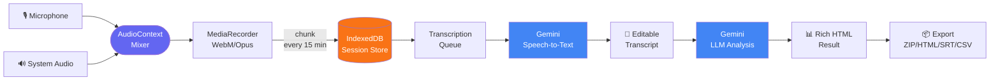
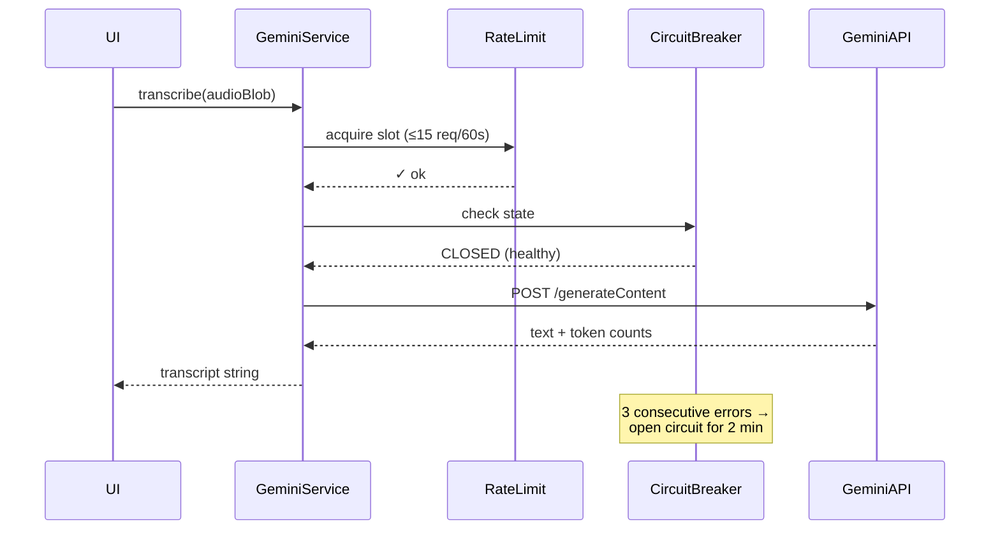
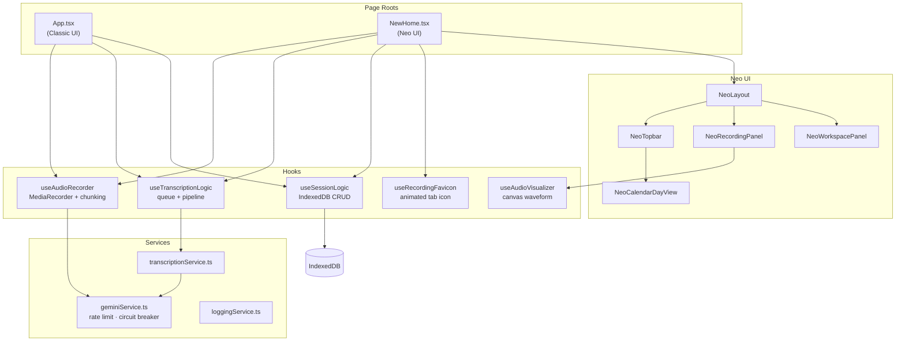
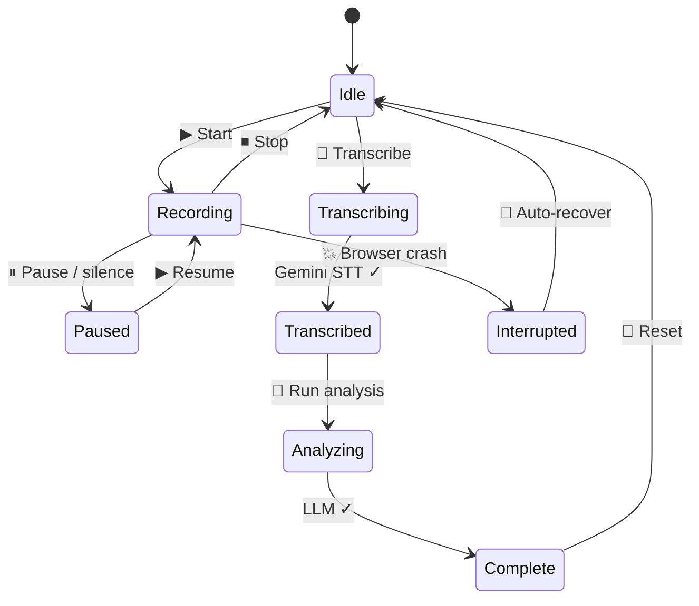
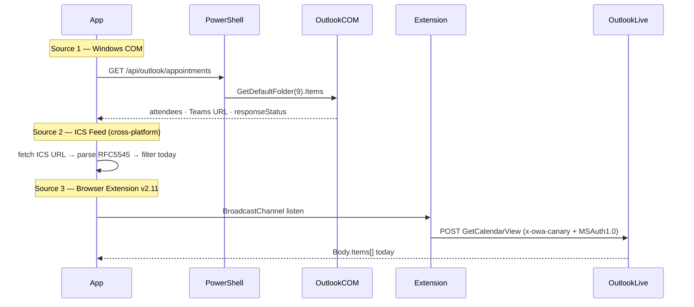

<div align="center">


<br/>

[](CHANGELOG.md)
[](https://react.dev)
[](https://typescriptlang.org)
[](https://vitejs.dev)
[](https://aistudio.google.com)
[](LICENSE)

<br/>

> **Fully in-browser AI meeting assistant.** Records mic + system audio, transcribes via Gemini STT, runs LLM analysis — no server, no tracking, all data stays in your browser.

<br/>

```
┌─────────────────────────────────────────────────────────────────┐
│  🎙️  Mic + System Audio                                         │
│       │                                                         │
│       ▼                                                         │
│  🔄  MediaRecorder  ──►  IndexedDB  ──►  Gemini STT             │
│                                               │                 │
│                                               ▼                 │
│  📊  Export (ZIP/HTML/SRT/CSV)  ◄──  Gemini LLM Analysis        │
└─────────────────────────────────────────────────────────────────┘
```

</div>

---

## ⚡ At a Glance

<table>
<tr>
<td width="25%" align="center">

### 🎙️ Recording
Mic + System Audio  
Chunked auto-save  
Live waveform  
Silence detection  
Emotion detection

</td>
<td width="25%" align="center">

### 📝 Transcription
Gemini STT  
Italian / English  
Queue pipeline  
SRT · CSV · HTML  
Editable output

</td>
<td width="25%" align="center">

### 🤖 AI Analysis
7 analysis modes  
Web search grounding  
Custom system prompts  
Rich HTML results  
Token tracking

</td>
<td width="25%" align="center">

### 💬 Chat
Multi-turn context  
Note images support  
12-turn history  
Inline SVG charts  
Markdown export

</td>
</tr>
</table>

---

## 🚀 Quick Start

<table>
<tr>
<td>

### 🖥️ macOS / Linux

```bash
# Clone & install
git clone https://github.com/carmelobattiato/audio-ai-assistant
cd audio-ai-assistant
npm install

# Set your Gemini API key
echo "GEMINI_API_KEY=your_key_here" > .env

# Launch dev server
npm run dev
# → http://localhost:8090
```

</td>
<td>

### 🪟 Windows (PowerShell)

```powershell
# Start (installs deps on first run + Desktop shortcut)
.\setup_and_run.ps1 start

# Control
.\setup_and_run.ps1 stop
.\setup_and_run.ps1 status
.\setup_and_run.ps1 reinstall

# Custom port
.\setup_and_run.ps1 start -Port 3000
# → http://127.0.0.1:8090
```

</td>
</tr>
</table>

> 🔑 Get a free Gemini API key at [aistudio.google.com/apikey](https://aistudio.google.com/apikey)

---

## 🧠 How It Works



---

## 🏗️ Architecture

<details open>
<summary><b>📦 Tech Stack</b></summary>

<br/>

| Layer | Technology | Why |
|-------|-----------|-----|
| **Frontend** | React 19 + TypeScript 5 | Concurrent rendering, strict types |
| **Build** | Vite 6 (OXC bundler) | Sub-second HMR, fast builds |
| **AI / Speech** | Google Gemini API v1 | Multimodal STT + LLM in one SDK |
| **Persistence** | IndexedDB via `idb` v8 | Zero-server, up to 50 MB/session |
| **Document parsing** | `mammoth` + `pdfjs-dist` | DOCX/PDF import for notes |
| **Calendar** | COM/ICS/Extension | Three parallel sources |
| **State** | Props + callbacks | No Redux, no Context — simple by design |

> **Zero backend.** The only outbound calls are to `generativelanguage.googleapis.com`.

</details>

<details>
<summary><b>🔌 Gemini API Resilience Pipeline</b></summary>

<br/>



`geminiService.ts` implements:

| Guard | Config | Behaviour |
|-------|--------|-----------|
| **Rate limiter** | 15 req / 60 s | Sliding window, configurable |
| **Circuit breaker** | 3 errors → open | Resets after 2 min cooldown |
| **Retry** | Exponential back-off | Transient failures only |
| **Token tracking** | Per call | Input + output logged |

</details>

<details>
<summary><b>🗺️ Component Map</b></summary>

<br/>



</details>

<details>
<summary><b>♻️ Session Lifecycle</b></summary>

<br/>



</details>

---

## 🎙️ Recording Engine

```
Audio Sources          Processing              Storage
──────────────         ──────────────          ──────────────
🎤 Microphone    ──►   AudioContext Mixer  ──► IndexedDB
🔊 System Audio  ──►   MediaRecorder       ──► (chunked blobs)
                       WebM / Opus              max 50 MB
```

| Feature | Detail |
|---------|--------|
| **Chunked recording** | Auto-save every N min (default 15) — safe for long sessions |
| **Auto-pause on silence** | Configurable threshold + timeout |
| **Emotion detection** | Real-time dominant emotion with color overlay |
| **Live transcription** | Streaming transcript during recording |
| **Audio quality** | 64 / 96 / **128** / 192 / 256 kbps · Mono/Stereo · Noise suppression |
| **Headphones mode** | Screen-share guide to capture system audio via `getDisplayMedia` |
| **Animated favicon** | Canvas-rendered red waveform in browser tab (32×32, 8 bars, 14 fps) |

---

## 🤖 AI Models

<table>
<tr>
<th>Model</th>
<th>Speed</th>
<th>Quality</th>
<th>Use for</th>
</tr>
<tr>
<td><code>gemini-3-flash-preview</code> ⭐ default</td>
<td>🟢 Fast</td>
<td>🟡 Good</td>
<td>Transcription + quick analysis</td>
</tr>
<tr>
<td><code>gemini-3-pro-preview</code></td>
<td>🟡 Medium</td>
<td>🟢 High</td>
<td>Detailed minutes, reports</td>
</tr>
<tr>
<td><code>gemini-2.5-flash</code></td>
<td>🟢 Fast</td>
<td>🟢 High</td>
<td>Best speed/quality balance</td>
</tr>
<tr>
<td><code>gemini-2.5-pro</code></td>
<td>🔴 Slow</td>
<td>🟢 Best</td>
<td>Complex analysis, research</td>
</tr>
<tr>
<td>Custom OpenAI-compatible</td>
<td>—</td>
<td>—</td>
<td>Any proxy / local model</td>
</tr>
</table>

### Analysis Modes

```
┌─────────────────────────────────────────────────────────┐
│  1. Custom instructions only                            │
│  2. Generate summary                                    │
│  3. Concise minutes  (email-ready)                      │
│  4. Detailed minutes (full coverage)                    │
│  5. 10 key points   (bullet list)                       │
│  6. Interview / dialogue format                         │
│  7. HTML report with timeline ◄── includes Bubble Notes │
└─────────────────────────────────────────────────────────┘
```

---

## 📅 Outlook Calendar Bridge

Three parallel sources — pick the one that fits your setup:



| Source | Platform | Latency | Data richness |
|--------|----------|---------|---------------|
| **Windows COM** | Windows only | Real-time | ★★★ Attendees, Teams URL, body |
| **ICS Feed** | Cross-platform | 1–3 h | ★★ Title, time, location |
| **Extension v2.11** | Chrome / Edge | ~30 s | ★★★ Full calendar data |

<details>
<summary>🔧 Extension Setup (v2.11)</summary>

1. Settings → Integrations → Browser Extension → download `calendar-bridge-v2.zip`
2. Extract → `chrome://extensions` → Developer mode → **Load unpacked**
3. Open `outlook.live.com/calendar`
4. Wait ~30 s → badge **"Outlook Live ● Connessa"** appears

The extension makes a direct `GetCalendarView` POST with `x-owa-canary` CSRF token — no passive interception, works on consumer Outlook Live.

</details>

---

## 💾 Session Management

```
┌────────────────────────────────────────────────────────────────┐
│                      Session  (IndexedDB)                      │
│                                                                │
│  📁 audio chunks    📝 transcript    🤖 LLM results            │
│  📌 bubble notes    💬 chat history  📊 statistics             │
│                                                                │
│  Max: 15 sessions · 50 MB each · auto-purge oldest            │
└────────────────────────────────────────────────────────────────┘
```

| Operation | Description |
|-----------|-------------|
| **Save** | Snapshot current session to IndexedDB |
| **Load** | Restore any saved session |
| **Continue** | Load + immediately resume recording |
| **Merge** | Combine two sessions into one |
| **Recover** | Auto-detect & recover crashed/interrupted sessions |
| **Import/Export** | JSON file for cross-device transfer |

---

## 📤 Export Formats

<table>
<tr>
<td align="center">📦<br/><b>ZIP</b><br/>Full archive</td>
<td align="center">🌐<br/><b>HTML</b><br/>Formatted report</td>
<td align="center">📋<br/><b>SRT</b><br/>Subtitles</td>
<td align="center">📊<br/><b>CSV</b><br/>Structured data</td>
<td align="center">📄<br/><b>TXT</b><br/>Plain transcript</td>
<td align="center">💬<br/><b>MD</b><br/>Chat export</td>
</tr>
</table>

---

## 📊 Statistics & Monitoring

```
Per-session telemetry
────────────────────────────────────────────
  🪙 Token usage      input / output per API call
  📝 Text stats       chars · words · estimated tokens · size
  🎵 Audio details    format · duration · bitrate · channels
  🎯 Coherence score  LLM analysis quality metric
  📋 Operation log    configurable level (Settings → Log & Monitoring)
```

---

## 🗂️ Project Structure

<details>
<summary>📁 Full file tree</summary>

```
audio-ai-assistant/
│
├── App.tsx                      # Classic UI root — all state, no Redux/Context
├── pages/
│   └── NewHome.tsx              # Neo UI root — mirrors App.tsx hooks
│
├── components/
│   ├── common/                  # Modal, ConfirmModal — shared primitives
│   ├── recorder/                # RecorderActions, RecorderStatus
│   ├── settings/                # Settings tab sub-components
│   ├── llm/                     # LLM provider selector, result renderer
│   ├── notes/                   # NoteBubble, screenshot toolbar
│   ├── newpage/                 # Neo UI shell
│   │   ├── NeoLayout.tsx
│   │   ├── NeoTopbar.tsx
│   │   ├── NeoRecordingPanel.tsx
│   │   ├── NeoWorkspacePanel.tsx
│   │   ├── NeoCalendarDayView.tsx
│   │   └── NeoTipsPanel.tsx
│   ├── AudioRecorder.tsx
│   ├── TranscriptionView.tsx
│   ├── LlmProcessor.tsx
│   ├── MeetingChatPanel.tsx
│   ├── BubbleNotes.tsx
│   ├── SettingsPanel.tsx
│   └── OutlookCalendarModal.tsx
│
├── hooks/
│   ├── useAudioRecorder.ts      # MediaRecorder + chunking + silence detection
│   ├── useAudioVisualizer.ts    # Canvas waveform renderer
│   ├── useTranscriptionLogic.ts # Queue + Smart Pipeline
│   ├── useSessionLogic.ts       # IndexedDB save/load/merge
│   └── useRecordingFavicon.ts   # Animated tab favicon
│
├── services/
│   ├── geminiService.ts         # Rate limiter + circuit breaker + retry
│   ├── transcriptionService.ts
│   └── loggingService.ts
│
├── utils/
│   ├── db.ts                    # IndexedDB CRUD (idb library)
│   ├── fileUtils.ts             # ZIP, SRT, HTML, CSV export
│   ├── audioUtils.ts
│   └── textUtils.ts
│
├── constants/
│   └── defaultSettings.ts       # Default model, language, rate limits
│
├── types.ts                     # Shared TypeScript interfaces
├── vite.config.ts               # Vite config + Outlook PowerShell bridge plugin
└── index.html                   # CSS variables (--neo-*), tooltip system
```

</details>

---

## 🛠️ Scripts & Deployment

| Script | Platform | Commands |
|--------|----------|----------|
| `github.sh` | macOS / Linux | `push` · `--pull-force` (overwrite local from remote) |
| `setup_and_run.ps1` | Windows | `start` · `stop` · `status` · `reinstall` |
| `setup_and_run.sh` | macOS / Linux | Same lifecycle for Unix |
| `backup.sh` | macOS / Linux | Local backup with size reporting |

---

## 📋 Latest Changes

### v1.118

- Rimosso `TranscriptionQuality` enum — prompt accuratezza massima sempre fisso
- Settings > General: card "Aggiornamento App" con verifica versione remota
- `github.sh --pull-force`: mostra repo, branch e ultimi 5 commit remoti prima della conferma
- Aggiornamento via `git fetch + reset --hard` con NDJSON streaming
- README redesign: hero section, badge shields.io, tabelle stack, sezioni collassabili

<details>
<summary>📜 Older versions</summary>

### v1.93 — 2026-04-29
- Chat textarea: double-height (4 rows, min 80 px), resizable up to 300 px
- Smart Pipeline: auto-transcription disabled when pipeline off
- `github_push.sh` → `github.sh` + `--pull-force` parameter

### v1.91 — 2026-04-29
- Settings → AI Rules: sub-tab "User Rules" / "System Prompts"
- 8 editable system prompts grouped by category
- Placeholders: `{{LANGUAGE}}`, `{{DATE}}`, `{{DIARIZATION}}`, `{{EXTRA}}`

### v1.76 — 2026-04-24
- New **Settings → AI Rules** tab — persistent rules injected into every Gemini call
- **✉ Prepare Email** button (Windows) — pre-filled Outlook draft from AI result
- Outlook attendee `type: 'required' | 'optional'` added to type definitions

### v1.75 — 2026-04-10
- Custom API key, base URL, model name in Settings
- Neo Calendar: parallel-meeting layout (up to 10 dynamic columns)
- Teams + Rec: opens Teams desktop via `msteams://` protocol

</details>

---

<div align="center">


**Built with ❤️ by [Carmelo Battiato](https://github.com/carmelobattiato)**

Powered by **Google Gemini** · No server · No tracking · All data stays in your browser

[](https://github.com/carmelobattiato/audio-ai-assistant)
[](https://github.com/carmelobattiato/audio-ai-assistant/issues)

</div>
