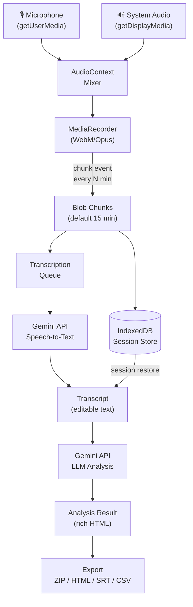
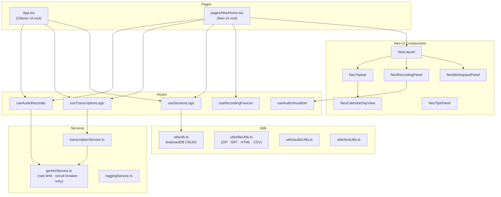
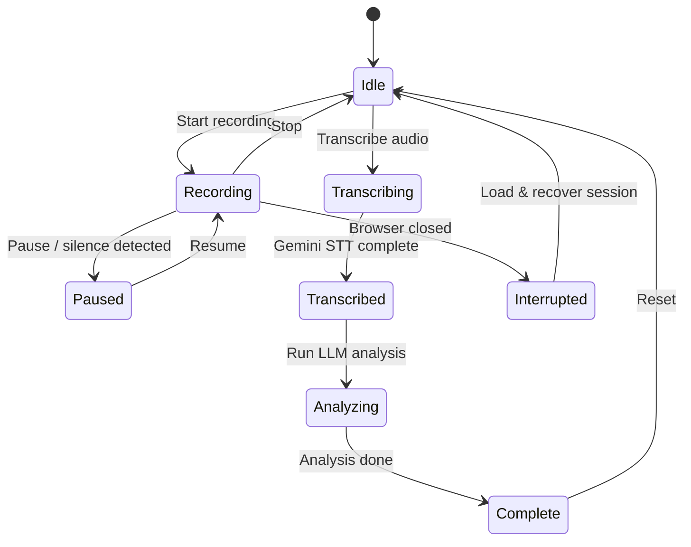
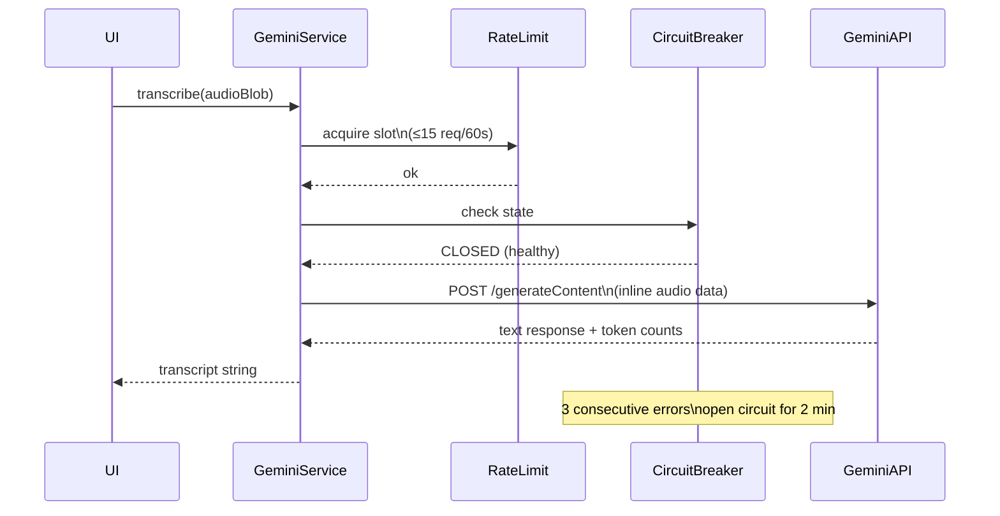
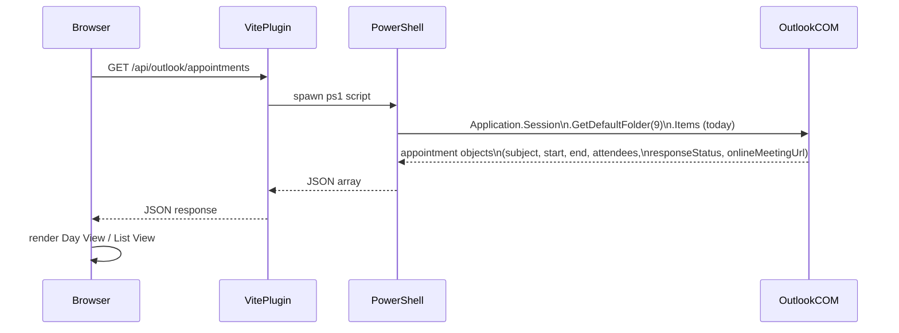

# Audio AI Assistant — v1.86

A **client-side-only** web app for audio recording, automatic transcription via Google Gemini, and LLM-powered analysis. Designed for recording meetings, interviews, and Teams/Zoom calls — with or without headphones.

Built by **Carmelo Battiato**.

---

## Quick Start (Windows)

The `setup_and_run.ps1` script manages the full application lifecycle: dependency installation, background startup, stop, and reinstall.

### Prerequisites

- **Node.js** v18 or higher — [nodejs.org](https://nodejs.org)
- **Google Gemini API Key** — [aistudio.google.com/apikey](https://aistudio.google.com/apikey)
- A `.env.local` file in the project root:
  ```
  GEMINI_API_KEY=your_api_key_here
  ```

### PowerShell Commands

```powershell
# Start the app in background (installs deps on first run)
.\setup_and_run.ps1 start

# Stop the service
.\setup_and_run.ps1 stop

# Check service status and access URL
.\setup_and_run.ps1 status

# Full reinstall (deletes node_modules and reinstalls)
.\setup_and_run.ps1 reinstall
```

On first `start`, npm dependencies are installed automatically and a Desktop shortcut is created.

The app is accessible at: **http://127.0.0.1:8090**

To use a different port: `.\setup_and_run.ps1 start -Port 3000`

### Alternative (terminal)

```bash
npm install
npm run dev       # dev server at http://localhost:8090
npm run build     # production build → dist/
npm run lint      # TypeScript type-checking (tsc --noEmit)
```

---

## Available Interfaces

Two coexisting UIs, switchable from the topbar:

| URL | Interface |
|-----|-----------|
| `/` | **Neo UI** — modern Accenture violet palette, two-panel glassmorphism layout |
| `/oldui` | **Classic UI** — original monochromatic dark interface |

---

## Architecture

### Stack

| Layer | Technology |
|-------|-----------|
| Frontend | React 19 + TypeScript |
| Build | Vite (OXC transformer) |
| AI / Speech | Google Gemini API (`@google/genai` v1) |
| Persistence | IndexedDB via `idb` v8 |
| Document parsing | `mammoth` (DOCX), `pdfjs-dist` (PDF) |
| Outlook bridge | Vite dev-only plugin → PowerShell COM automation |

**No backend. No server database. All data stays in the browser (IndexedDB).** The only outbound network calls are to the Google Gemini API.

---

### High-Level Data Flow



---

### Component & Module Map



---

### Session Lifecycle



---

### Gemini API Call Pipeline



---

### Outlook Calendar Bridge (Windows only)



---

## Features

### Recording

- Start / Pause / Resume
- Real-time waveform visualizer
- **Chunked recording**: auto-saves every N minutes (default 15) to IndexedDB — safe for long sessions
- **Auto-pause on silence**: configurable threshold and timeout
- **Real-time emotion detection**: dominant emotion shown with color overlay
- **Live transcription**: streaming transcript during recording
- Import existing audio files for transcription
- **Integrated screenshots**: manual or auto at configurable intervals

**Audio quality settings:**

| Setting | Options |
|---------|---------|
| Bitrate | 64 / 96 / 128 (default) / 192 / 256 kbps |
| Channels | Mono (default) / Stereo |
| Mic filters | Noise suppression, echo cancellation, auto gain control |

---

### System Audio Capture (headphones mode)

When headphones are in use the microphone cannot pick up speaker output. Click **"Rec with headphones"** to open the screen-share guide:

1. Open the browser's screen-share dialog
2. Select **"Entire Screen"** tab (not "Chrome Tab")
3. Enable **"Also share system audio"**
4. Click **Share** — the app mixes mic + system audio via `AudioContext`

Click **"Rec without headphones"** in the dialog footer to skip screen share and record mic only.

---

### Transcription

Powered by Google Gemini multimodal speech-to-text.

| Setting | Options |
|---------|---------|
| Language | Italian (default), English |
| Quality | 5 levels — Fast/Basic → Best/Slow |
| Output format | TXT, SRT, CSV, HTML |

- Transcription queue with multi-file sequencing
- **Smart Pipeline**: auto-starts transcription → LLM analysis on recording stop
- Transcript is fully editable inline before analysis

---

### LLM Analysis

Processes the transcript with Google Gemini.

| Action | Description |
|--------|-------------|
| Custom instructions only | Apply only the user-supplied prompt |
| Generate summary | Concise content summary |
| Concise minutes (email style) | Short meeting minutes ready to send |
| Detailed minutes (email style) | Full minutes with all points covered |
| 10 key points | Bulleted list of main concepts |
| Interview / dialogue format | Reformats as dialogic transcript |
| HTML report with timeline | Formatted report with timeline, speakers, embedded notes |

**Available models:**

| Model ID | Notes |
|----------|-------|
| `gemini-3-flash-preview` | Default — fast, cost-efficient |
| `gemini-3-pro-preview` | Higher quality |
| `gemini-2.5-pro` | Most capable |
| `gemini-2.5-flash` | Fast + capable |
| Custom OpenAI-compatible endpoint | Any URL + model name |

- **Web search** (Google models only): grounds analysis with live search results and citations
- Rich-text result editor
- Copy result as rich HTML (preserves formatting in Outlook / Gmail)

---

### Chat with the Meeting Session

Interactive multi-turn chat tab (next to AI Analysis) with full meeting context.

- Full transcript + AI analysis injected as system context on every call
- Multi-turn conversation — history of last 12 exchanges passed to the model
- **Response formats**: markdown text, tables, code blocks, inline SVG bar charts
  - Charts rendered from a `chart` code block: `{"type":"bar","title":"...","labels":[...],"values":[...],"unit":""}`
- Quick-start suggestion chips (action items, decisions, follow-up email, etc.)
- Per-message copy button (hover to reveal)
- **Export chat as Markdown** (`.md` download)
- Chat history **persisted in IndexedDB** and saved to session JSON — fully restored on session load

---

### Bubble Notes

Contextual annotation system synchronized with the recording.

- Rich-text editor (bold, italic, colors, lists, links, images)
- Automatic timestamp tied to recording time
- **Integrated screenshots**: manual or auto-interval with countdown
- Import images, documents, PDFs, and presentations
- Notes are included in LLM analysis (e.g. HTML report with timeline)
- Fullscreen viewer
- Export notes as HTML

---

### Outlook Calendar (Neo UI)

Integration with Microsoft Outlook via a PowerShell bridge (Windows with Outlook installed only).

The **Calendar** button in the topbar opens a modal with two switchable views:

**Calendar View (Day View)**
- Outlook-style layout with 00:00–24:00 time slots
- Colored rectangles proportional to meeting duration
- Parallel meetings shown side-by-side (up to 10 dynamic columns, no overlaps)
- Red current-time indicator with auto-scroll to current hour
- Solid hour lines + dashed 30-minute lines
- Status colors: green (ongoing), amber (next), violet (future), grey (past)

**List View**
- Compact list of all today's meetings
- Click a card to expand attendees

**Common features:**
- Response status badges: ✓ Accepted · ~ Tentative · ★ Organizer · ✗ Declined
- Select a meeting → quick action bar:
  - **Show Info**: detailed modal (attendees with initials, location, organizer, Teams link, body)
  - **Teams + Rec**: opens Teams desktop via `msteams://` protocol (no Chrome window), loads meeting info into notes, triggers System Audio guide
  - **Load Info**: imports title and attendees into session notes
- Manual refresh

---

### Session Management

- Up to **15 sessions** stored in IndexedDB (browser local storage, no server)
- Each session: audio chunks, transcript, LLM results, notes, statistics
- Operations: save, load, merge, overwrite
- Automatic recovery of sessions interrupted by browser crash
- Max 50 MB per session

---

### Export

| Format | Content |
|--------|---------|
| ZIP | Full archive: audio + transcript + LLM result + notes |
| TXT | Transcript text with optional metadata header |
| SRT | Subtitles (compatible with video editors and players) |
| CSV | Structured transcript data |
| HTML | Formatted report ready for printing or sharing |

---

### Statistics & Monitoring

- Token count (input/output) per API call
- Text stats: characters, words, estimated tokens, size
- Audio details: format, duration, bitrate, channels
- Coherence score for LLM analysis
- Operation log with configurable level (Settings → Log & Monitoring tab)

---

### Animated Recording Favicon

While recording, the browser tab favicon is replaced with a **canvas-animated red waveform**:

- 32×32 canvas, 8 sine-wave bars, 14 fps (throttled via `requestAnimationFrame`)
- A new `<link rel="icon">` is injected at the end of `<head>` — browsers use the last matching favicon link, so this overrides all static icons without touching them
- On stop, the injected element is removed and the originals are restored automatically

---

## Project Structure

```
audio-ai-assistant/
├── App.tsx                    # Classic UI root — all state, no Redux/Context
├── pages/
│   └── NewHome.tsx            # Neo UI root — mirrors App.tsx state
├── components/
│   ├── common/                # Modal, ConfirmModal — shared primitives
│   ├── recorder/              # RecorderActions, RecorderStatus
│   ├── settings/              # Settings tab sub-components
│   ├── llm/                   # LLM provider selector, result renderer
│   ├── notes/                 # NoteBubble, screenshot toolbar
│   ├── newpage/               # Neo UI shell components
│   │   ├── NeoLayout.tsx
│   │   ├── NeoTopbar.tsx
│   │   ├── NeoRecordingPanel.tsx
│   │   ├── NeoWorkspacePanel.tsx
│   │   ├── NeoCalendarDayView.tsx
│   │   └── NeoTipsPanel.tsx
│   ├── AudioRecorder.tsx
│   ├── TranscriptionView.tsx
│   ├── LlmProcessor.tsx
│   ├── MeetingChatPanel.tsx
│   ├── BubbleNotes.tsx
│   ├── SettingsPanel.tsx
│   └── OutlookCalendarModal.tsx
├── hooks/
│   ├── useAudioRecorder.ts    # MediaRecorder + chunking + silence detection
│   ├── useAudioVisualizer.ts  # Canvas waveform renderer
│   ├── useTranscriptionLogic.ts
│   ├── useSessionLogic.ts     # IndexedDB save/load/merge
│   └── useRecordingFavicon.ts # Animated tab icon during recording
├── services/
│   ├── geminiService.ts       # Rate limiter + circuit breaker + retry
│   ├── transcriptionService.ts
│   └── loggingService.ts
├── utils/
│   ├── db.ts                  # IndexedDB CRUD (idb library)
│   ├── fileUtils.ts           # ZIP, SRT, HTML, CSV export
│   ├── audioUtils.ts
│   └── textUtils.ts
├── constants/
│   └── defaultSettings.ts
├── types.ts                   # Shared TypeScript types
├── vite.config.ts             # Vite config + Outlook PowerShell bridge plugin
└── index.html                 # CSS variables (--neo-*), tooltip system
```

---

## Changelog

### v1.76 — 2026-04-24

#### AI Rules (custom prompt instructions)
- New **Settings → AI Rules** tab for managing persistent prompt rules applied to every AI Analysis.
- Each rule has a name, instruction text, and an enable/disable toggle — active rules are injected into the Gemini `systemInstruction` on every analysis call.
- Typical use: terminology corrections (`"when you read T&D replace with T&A"`), style directives, mandatory sections.
- Rules persist in `localStorage` alongside all other settings and survive app restarts.

#### Prepare Email (Windows)
- New **✉ Prepare Email** button in the AI Analysis result toolbar (visible on Windows only), placed alongside Download / Copy Text / Edit Result.
- Opens the system mail client (Outlook or default) with a pre-filled draft — no send, no LLM re-elaboration:
  - **Subject**: taken directly from the recording title field.
  - **Body**: the plain-text version of the already-generated AI Analysis result.
  - **To**: required meeting attendees (from Outlook calendar import).
  - **CC**: optional meeting attendees (from Outlook calendar import).
  - **Fallback**: if the meeting was not imported from the calendar, emails are extracted automatically from Bubble Notes.
- Uses proper URI percent-encoding (`encodeURIComponent`) for subject and body — avoids the `+` corruption caused by `URLSearchParams` form encoding.

#### Outlook Calendar — attendee data threading
- `OutlookAppointment.Attendee` extended with optional `type: 'required' | 'optional'` field, ready for when the PowerShell bridge exposes the Exchange attendee type.
- Calendar import callbacks (`onImport`, `onOpenTeamsAndRecord`) now propagate the full attendee array from `NeoCalendarDayView` and `OutlookCalendarModal` through to `NewHome` state and down to `LlmProcessor`.

---

### v1.75 — 2026-04-10

- LLM Configuration: custom API key, custom base URL, and editable model name exposed in Settings.
- Added new Gemini model entries to the selection table (`gemini-3-flash-preview`, `gemini-3-pro-preview`).
- Neo Calendar Day View: parallel-meeting layout algorithm (connected-component grouping, up to 10 dynamic columns).
- Teams + Rec: opens Teams desktop via `msteams://` protocol to avoid Chrome opening the web client.
- Auto-screenshot interval configurable in Settings (Transcription & Notes tab).
- Improved ZIP export: includes AI analysis HTML alongside transcript and audio.
- Various UI polish and bug fixes.

---

## Technical Notes

### State Management
All state lives in `App.tsx` (~565 lines) and `pages/NewHome.tsx`. No Redux or Context API — props and callbacks are drilled down. The two page roots share identical hook calls; Neo UI re-renders the same child components inside glassmorphism card wrappers.

### CSS Theming
The Neo UI uses CSS custom properties (`--neo-bg`, `--neo-primary`, etc.) defined in `index.html`. A `.neo-ctx` context class scopes Tailwind overrides so existing gray-palette components render in violet without being modified.

### LLM Configuration (Google provider)
In **Settings → LLM Configuration**, the Google provider section now exposes:
- **Google API Key** — paste a key directly in the UI; takes precedence over the `.env` system key. Supports show/hide toggle and one-click removal to fall back to the system key.
- **API Base URL** — optional custom endpoint (proxy, Vertex AI, etc.). Placeholder shows the official default: `https://generativelanguage.googleapis.com`.
- **Model name (editable)** — free-text override for any model ID not yet in the selection table.
- **Model selection table** — quick picker for known Gemini models.

### Gemini API Resilience
`geminiService.ts` implements:
- **Rate limiter**: sliding window, default 15 req / 60 s (configurable)
- **Circuit breaker**: opens after 3 consecutive errors, resets after 2 minutes
- **Retry**: exponential back-off on transient failures
- **Token tracking**: input + output tokens logged per call

### Outlook Bridge
`vite.config.ts` contains a dev-only Vite plugin that intercepts `GET /api/outlook/*` requests and spawns a PowerShell process that reads the Outlook calendar via COM automation (`Application.Session.GetDefaultFolder(9)`). Includes `responseStatus` mapped from the Outlook `OlResponseStatus` enum (0–5).

### Path Alias
`@/` maps to the project root in both `tsconfig.json` and `vite.config.ts`.
